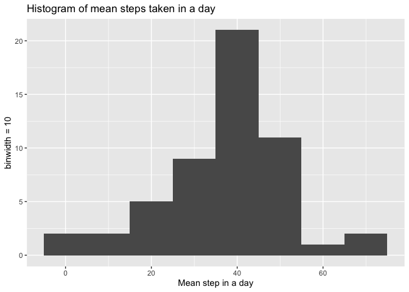
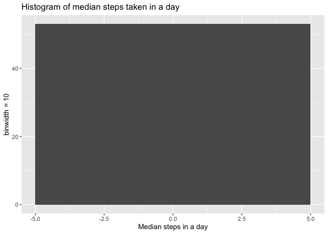
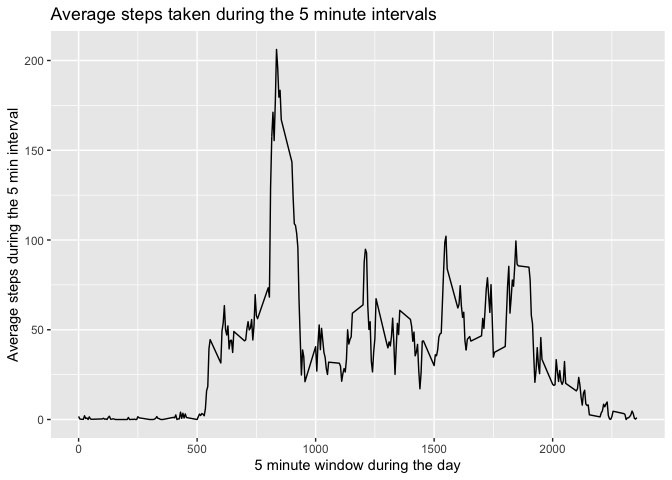
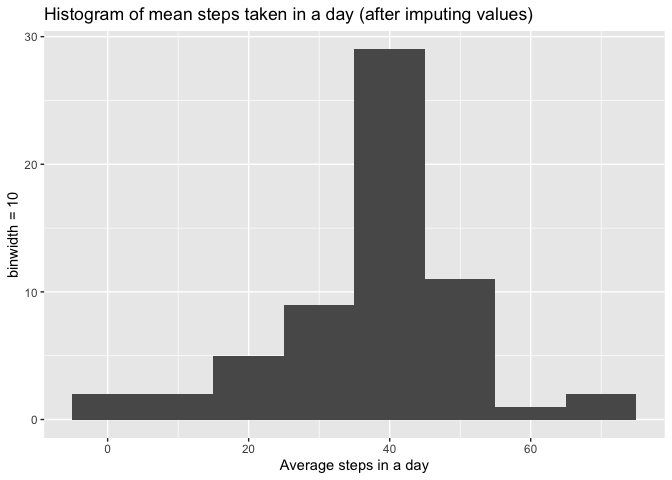
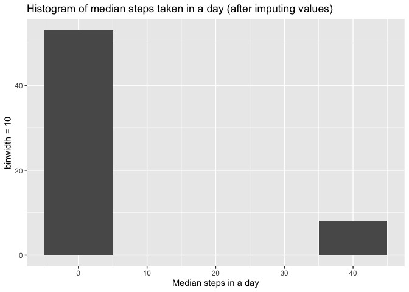
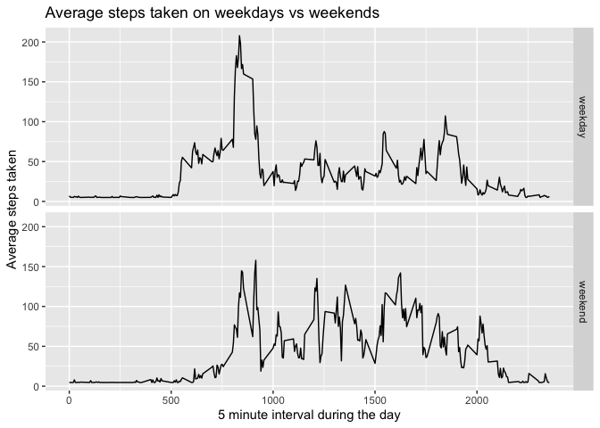

## Loading and preprocessing the data

For this assignment I would be using the following packages, dplyr and ggplot2


```r
knitr::opts_chunk$set(fig.path="figure/")
library(dplyr)
```

```
## 
## Attaching package: 'dplyr'
```

```
## The following objects are masked from 'package:stats':
## 
##     filter, lag
```

```
## The following objects are masked from 'package:base':
## 
##     intersect, setdiff, setequal, union
```

```r
library(ggplot2)
```

First unzip the data and read the data from the csv into a data frame


```r
unzip("activity.zip")
df <- read.csv("activity.csv")
dim(df)
```

```
## [1] 17568     3
```

```r
head(df)
```

```
##   steps       date interval
## 1    NA 2012-10-01        0
## 2    NA 2012-10-01        5
## 3    NA 2012-10-01       10
## 4    NA 2012-10-01       15
## 5    NA 2012-10-01       20
## 6    NA 2012-10-01       25
```
After examining the first few rows, we notice that there is a date column, but lets see if the date column is of type "Date, if not let's convert to "Date" type

```r
class(df$date)
```

```
## [1] "character"
```

```r
df$date <- as.Date(df$date, "%Y-%m-%d")
class(df$date)
```

```
## [1] "Date"
```

Now using dplyr let's group by date and find the mean number of steps taken in a day

```r
mean_by_day <- df %>% group_by(date) %>% summarize(mean_steps = mean(steps, na.rm = TRUE)) 
summary(mean_by_day)
```

```
##       date              mean_steps     
##  Min.   :2012-10-01   Min.   : 0.1424  
##  1st Qu.:2012-10-16   1st Qu.:30.6979  
##  Median :2012-10-31   Median :37.3785  
##  Mean   :2012-10-31   Mean   :37.3826  
##  3rd Qu.:2012-11-15   3rd Qu.:46.1597  
##  Max.   :2012-11-30   Max.   :73.5903  
##                       NA's   :8
```

```r
median_by_day <- df %>% group_by(date) %>% summarize(median_steps = median(steps, na.rm = TRUE)) 
summary(median_by_day)
```

```
##       date             median_steps
##  Min.   :2012-10-01   Min.   :0    
##  1st Qu.:2012-10-16   1st Qu.:0    
##  Median :2012-10-31   Median :0    
##  Mean   :2012-10-31   Mean   :0    
##  3rd Qu.:2012-11-15   3rd Qu.:0    
##  Max.   :2012-11-30   Max.   :0    
##                       NA's   :8
```

## What is mean total number of steps taken per day?

Now we want to plot the above data as a histogram


```r
gg <- ggplot(mean_by_day, aes(x = mean_steps)) + geom_histogram(binwidth=10) + labs(title = "Histogram of mean steps taken in a day", x = "Mean step in a day", y = "binwidth = 10")
plot(gg)
```

```
## Warning: Removed 8 rows containing non-finite values (stat_bin).
```

<!-- -->


```r
gg <- ggplot(median_by_day, aes(x = median_steps)) + geom_histogram(binwidth=10) + labs(title = "Histogram of median steps taken in a day", x = "Median steps in a day", y = "binwidth = 10")
plot(gg)
```

```
## Warning: Removed 8 rows containing non-finite values (stat_bin).
```

<!-- -->

## What is the average daily activity pattern?

We can the same mean function as above instead of grouping by date, we can group by interval


```r
mean_by_interval <- df %>% group_by(interval) %>% summarize(mean_steps = mean(steps, na.rm = TRUE))
```

To find the max we can display the max row using which.max 

```r
max_row <- mean_by_interval[which.max(mean_by_interval$mean_steps),]
max_row
```

```
## # A tibble: 1 × 2
##   interval mean_steps
##      <int>      <dbl>
## 1      835       206.
```

We can use the plot function to plot the interval on x-axis and the mean steps in that interval on the y-axis


```r
gg <- ggplot(mean_by_interval, aes(x = interval, y = mean_steps)) + geom_line() + labs(title = "Average steps taken during the 5 minute intervals", x = "5 minute window during the day", y = "Average steps during the 5 min interval")
plot(gg)
```

<!-- -->

This user had most number of steps at 8:35 and had more steps during that period in general compared to the rest of the day between 8:00 - 9:00 


## Imputing missing values


```r
sum(is.na(df$steps))
```

```
## [1] 2304
```

There are a total of 2304 missing rows. One reason for missing values could be tracking steps while sleeping or if the subject didn't wear the tracking device during sleep. We will use the mean to impute missing values i.e. replace the missing values in the column with the mean of the column. 


```r
imputed <- df
imputed$steps[is.na(imputed$steps)] <- mean(imputed$steps, na.rm = TRUE)
head(imputed)
```

```
##     steps       date interval
## 1 37.3826 2012-10-01        0
## 2 37.3826 2012-10-01        5
## 3 37.3826 2012-10-01       10
## 4 37.3826 2012-10-01       15
## 5 37.3826 2012-10-01       20
## 6 37.3826 2012-10-01       25
```


```r
imputed_mean_by_day <- imputed %>% group_by(date) %>% summarize(mean_steps = mean(steps, na.rm = TRUE))
gg <- ggplot(imputed_mean_by_day, aes(x = mean_steps)) + geom_histogram(binwidth=10) + labs(title = "Histogram of mean steps taken in a day (after imputing values)", x = "Average steps in a day", y = "binwidth = 10")
plot(gg)
```

<!-- -->


```r
imputed_median_by_day <- imputed %>% group_by(date) %>% summarize(median_steps = median(steps, na.rm = TRUE))
gg <- ggplot(imputed_median_by_day, aes(x = median_steps)) + geom_histogram(binwidth=10) + labs(title = "Histogram of median steps taken in a day (after imputing values)", x = "Median steps in a day", y = "binwidth = 10")
plot(gg)
```

<!-- -->

Both the mean and the median steps increased after imputing values

## Are there differences in activity patterns between weekdays and weekends?


```r
imputed$week <- factor(ifelse(weekdays(imputed$date) %in% c("Saturday", "Sunday"), "weekend", "weekday"))
head(imputed)
```

```
##     steps       date interval    week
## 1 37.3826 2012-10-01        0 weekday
## 2 37.3826 2012-10-01        5 weekday
## 3 37.3826 2012-10-01       10 weekday
## 4 37.3826 2012-10-01       15 weekday
## 5 37.3826 2012-10-01       20 weekday
## 6 37.3826 2012-10-01       25 weekday
```

```r
imputed_mean_by_week <- imputed %>% group_by(week, interval) %>% summarize(mean_steps = mean(steps, na.rm = TRUE))
```

```
## `summarise()` has grouped output by 'week'. You can override using the
## `.groups` argument.
```

```r
head(imputed_mean_by_week)
```

```
## # A tibble: 6 × 3
## # Groups:   week [1]
##   week    interval mean_steps
##   <fct>      <int>      <dbl>
## 1 weekday        0       7.01
## 2 weekday        5       5.38
## 3 weekday       10       5.14
## 4 weekday       15       5.16
## 5 weekday       20       5.07
## 6 weekday       25       6.30
```

Now let's plot the above imputed values and see if there is a difference between weekday and weekend activity


```r
gg <- ggplot(imputed_mean_by_week, aes(x = interval, y = mean_steps, fill = week)) + geom_line() + facet_grid(week~.) + labs(title = "Average steps taken on weekdays vs weekends", x = "5 minute interval during the day", y = "Average steps taken")
plot(gg)
```

<!-- -->

On weekdays there is maximum activity between 8:00 - 10:00, then there is very less activity after that fewer than 100 steps

On weekends however there is moderate activity throughout the day between 50 -150 steps. 
